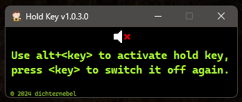

# HoldKey 
This is **HoldKey**.  
It will hold key when your press `alt+<key>`.  
Also works for alt+left-mouse-button.

## Motivation
Do you also play Palword or some RPG, survival, farming, building game thing?  
Does holding the F-key for minutes also overstrain you?  
Does your wrist hurt because of pressing the left mouse button for ages?

Take a break while **HoldKey** holds the key for you!

## Prerequisites
Microsoft Windows with [.Net 4.8 or higher](https://dotnet.microsoft.com/en-us/download/dotnet-framework) (should be there already on Win10/11).

## Installation
Download the most recent archive from the [Releases](https://github.com//dichternebel/hold-key/releases/latest/) and extract.

## Usage
Doubleclick the extracted file.  
-> It's launched and located in the *system tray* then (a.k.a. *Notification Center* a.k.a. *taskbar notification area* a.k.a. that-arrow-toggle-thing-with-nested-icons-to-be-hidden-from-the-taskbar).

### Advanced usage
Create a shortcut and add the parameter `EnableSound` to enable activity sound by default.

## Known issues
Your antivirus program might get nervous, because technically this is a keystroke interceptor that uses the same mechanism like a software based keylogger.

## Limitations
Should work with most if not all of the games or apps out there.  
If not, you have to hold the key by yourself or use some gaffer tape. ;-)

## Credits
Thanks for sharing:  
[Eunbin Jeong](https://github.com/Dalgona) and [Gregor Dostal](https://github.com/Gh0stWalk3r).

Thanks for testing:  
5arah, Nilu00 and [ropi87](https://www.twitch.tv/ropi87).

## References
- [InputHookHelper](https://gist.github.com/Dalgona/275ebc861eeac74c1a8d9d437d220f3b)
- [InputSimulatorStandard](https://github.com/GregsStack/InputSimulatorStandard)